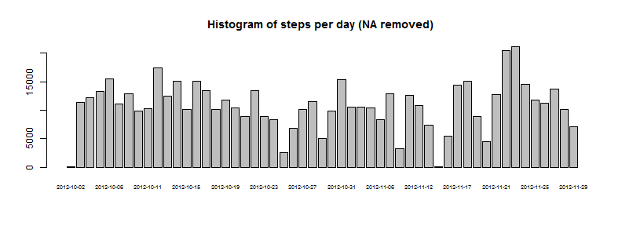
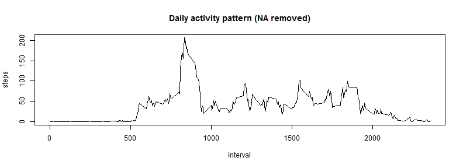

# Reproducible Research: Peer Assessment 1


## Loading and preprocessing the data


```r
library(timeDate)
```

```
## Warning: package 'timeDate' was built under R version 3.0.3
```

```r

rawdata <- read.csv("activity.csv")
data1 <- rawdata[!is.na(rawdata$steps), ]
hist1data <- aggregate(steps ~ date, data = data1, sum)

mean1data <- mean(hist1data$steps)
median1data <- median(hist1data$steps)
```


## What is mean total number of steps taken per day?

Mean total number of steps taken per day is **1.0766 &times; 10<sup>4</sup> steps** and median is **10765 steps**.

## Histogram of data for given time without missing values


```r
barplot(hist1data$steps, names.arg = hist1data$date, cex.names = 0.6)
```

 

## What is the average daily activity pattern?

```r
time1data <- aggregate(steps ~ interval, data = data1, mean)
maxsteps <- max(time1data$steps)
maxindex <- time1data[which.max(time1data$steps), 1]
plot(time1data, type = "l")
```

 

Maximum average number of steps is **206.1698 steps** and it is in interval **"835" interval**.

## Imputing missing values
Missing data will be replaced by average number of steps for particular interval based on previous calculation.


```r
newdata <- rawdata
missingdata <- sum(is.na(rawdata$steps))
i <- 0
for (x in newdata$steps) {
    i <- i + 1
    if (is.na(x)) {
        temp <- i%%nrow(time1data)
        if (temp == 0) {
            newdata[i, 1] <- time1data[1, 2]
        } else {
            newdata[i, 1] <- time1data[temp, 2]
        }
    }
}
```

There is all together **2304** missing values

## Are there differences in activity patterns between weekdays and weekends?
