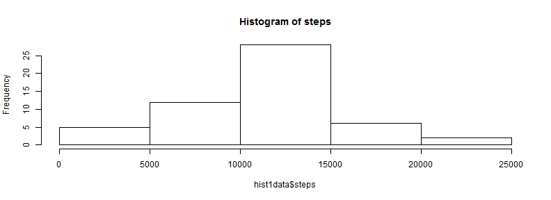
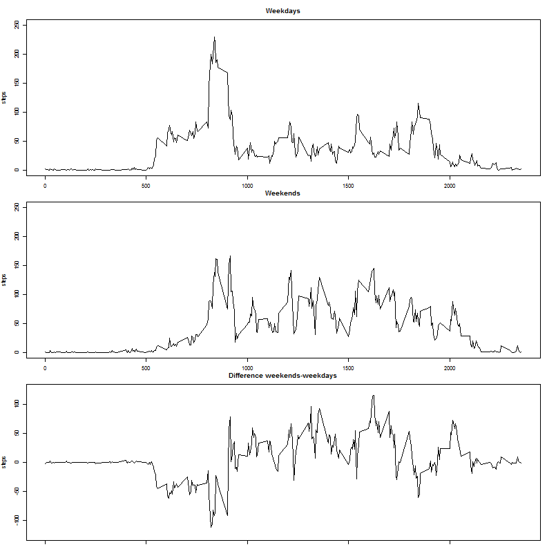

# Reproducible Research: Peer Assessment 1


## Loading and preprocessing the data


```r
library(timeDate)
```

```
## Warning: package 'timeDate' was built under R version 3.0.3
```

```r
rawdata<-read.csv("activity.csv")
data1<-rawdata[!is.na(rawdata$steps),]
hist1data<-aggregate( steps ~ date , data = data1 , sum )

mean1data<-mean(hist1data$steps)
median1data<-median(hist1data$steps)
```

## What is mean total number of steps taken per day?

Mean total number of steps taken per day is **1.0766 &times; 10<sup>4</sup> steps** and median is **10765 steps**.

## Histogram of data for given time without missing values


```r
hist(hist1data$steps,main = paste("Histogram of" , "steps"))
```

 
## What is the average daily activity pattern?

```r
time1data<-aggregate( steps ~ interval , data = data1 , mean )
maxsteps<-max(time1data$steps)
maxindex<-time1data[which.max(time1data$steps),1]
plot(time1data, type="l", main="Daily activity pattern (NA removed)")
```

 
Maximum average number of steps is **206.1698 steps** and it is in interval **"835" interval**.

## Imputing missing values
Missing data will be replaced by average number of steps for particular interval based on previous calculation.


```r
newdata<-rawdata
missingdata<-sum(is.na(rawdata$steps))
i<-0
for (x in newdata$steps){
        i<-i+1
        if(is.na(x)){
                temp<-i%%nrow(time1data)
                if (temp == 0){
                        newdata[i,1]<-time1data[1,2]        
                        }
                else {
                        newdata[i,1]<-time1data[temp,2]
                        }
                }
        }
```
There is all together **2304** missing values


```r
hist2data<-aggregate( steps ~ date , data = newdata , sum )
mean2data<-mean(hist2data$steps)
median2data<-median(hist2data$steps)
```

```r
hist(hist1data$steps,main = paste("Histogram of" , "steps"))
```

 
Mean total number of steps taken per day with filled NA according to given formula is **1.0766 &times; 10<sup>4</sup> steps** and median is **1.0767 &times; 10<sup>4</sup> steps**.

Difference is **0.0841 steps** in favour of "replaced NA data" and difference in median is **1.8302 steps** in favour of "replaced NA data".

## Are there differences in activity patterns between weekdays and weekends?

### Preprocessing the data

```r
timevector<-newdata$date
timevector<- strptime(timevector, "%Y-%m-%d", tz = "")
newtimevector<-c()
for (i in 1:length(timevector)){
        if(isWeekday(timevector[i], wday = 1:5)){
                newtimevector[i]<-"weekday"
                }
        else {
                newtimevector[i]<-"weekend"
                }
        }
newtimevector<-as.factor(newtimevector)
newdata<-cbind(newdata, newtimevector)
```
### Extracting the data

```r
weekdays <- subset(newdata, newtimevector=="weekday", select=c(steps, interval))
plotweekdays<-aggregate( steps ~ interval , data = weekdays , mean )

weekend <- subset(newdata, newtimevector=="weekend", select=c(steps, interval))
plotweekend<-aggregate( steps ~ interval , data = weekend , mean )

plotdifference<-plotweekend
plotdifference$steps<-plotdifference$steps-plotweekdays$steps

sumweekdays<-sum(plotweekdays$steps)
sumweekends<-sum(plotweekend$steps)
```
### Panel plot

```r
par(mfrow=c(3,1), mar=c(1,4,3,1))
plot(plotweekdays, type="l", main="Weekdays",ylim=c(0, 250))
plot(plotweekend, type="l", main="Weekends", ylim=c(0, 250))
plot(plotdifference, type="l", main="Difference weekends-weekdays", ylim=c(-125, 125))
```

 
Average number of steps in one day durong weekdays is **1.0256 &times; 10<sup>4</sup> steps** and on weekend is **1.2202 &times; 10<sup>4</sup> steps**.

From this we can conclude that **activity is higher during weekend** and comparing the graphs, **activity resulting in diffenerce is mainly occuring during afternoon hours**. **During weekdays the peak of activity is 8 in the morning**, and generaly **during weekdays is higher activity in early morning.**
